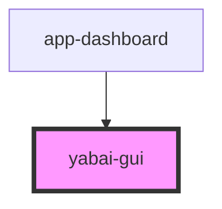

# yabai-gui

<!-- Auto Generated Below -->

## Properties

| Property  | Attribute | Description | Type     | Default     |
| --------- | --------- | ----------- | -------- | ----------- |
| `version` | `version` |             | `string` | `'v7.1.17'` |

## Events

| Event             | Description | Type                         |
| ----------------- | ----------- | ---------------------------- |
| `commandExecuted` |             | `CustomEvent<CommandResult>` |

## Dependencies

### Used by

 - [app-dashboard](../app-dashboard)

### Graph

----------------------------------------------

*Built with [StencilJS](https://stenciljs.com/)*
